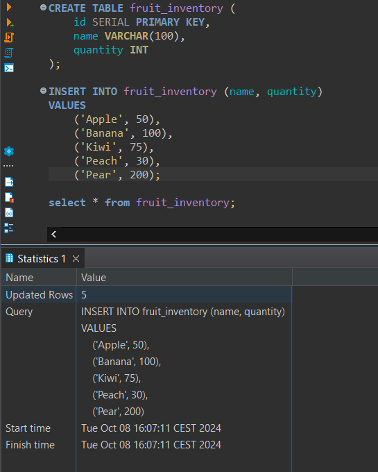

Deliverable 

# Assignment 7 - Docker

## Experiment 1
Already had docker installed

Downloaded the image & used the command

```
docker run -p 5432:5432 \
 -e POSTGRES_USER=test \
 -e POSTGRES_PASSWORD=test \
 -e POSTGRESS_DB=test_db \
 -d --name my-postgres --rm postgres
```
("run" was not specified in your example command)

docker ps gave:

```
CONTAINER ID   IMAGE      COMMAND                  CREATED          STATUS          PORTS                    NAMES
0ce95a2a39d3   postgres   "docker-entrypoint.s…"   11 seconds ago   Up 10 seconds   0.0.0.0:5432->5432/tcp   my-postgres
```

And yeah i managed to work w the dataase @ 0.0.0.0:5432
Localhost didn't work



Then i did the jpa_client query

And added the lines of code etc. to the JPA assignment

The tests failed yeah, on a persistance test

I changed the docker run to include a mount as i understood it to be correct

```
docker run -p 5432:5432 \
 -e POSTGRES_USER=test \
 -e POSTGRES_PASSWORD=test \
 -e POSTGRESS_DB=test_db \
 --mount type=bind,source=/wsl.localhost/root/DAT250/dat250-jpa-docker,target=/docker-entrypoint-initdb.d \
 -d --name my-postgres --rm postgres
```

Most of the time the docker container would just doe after about 3 secounds, unless i specified the directory to a file

This one seemed to be correct, but the tests still wouldn't fail. From what i could gather it experienced some sort of SQL grammar issue. The original project without the changes still passed. 

I talked with some other students about this and they also seemed stuck with something simmilar.

I also tried changing the IP in the persistance.xml but that didn't seem to fix anything

## Experiment 2
I ended up writing this Dockerfile based on what i could read on the internet
```
FROM gradle:8.8-jdk21

WORKDIR /home/gradle/project

COPY --chown=gradle:gradle . .

RUN gradle bootJar --no-daemon

EXPOSE 8080

CMD ["java", "-jar", "/home/gradle/project/build/libs/demo-0.0.1-SNAPSHOT.jar"]
```

Building took ~310s

I managed to make it run without an error after a couple of attempts

